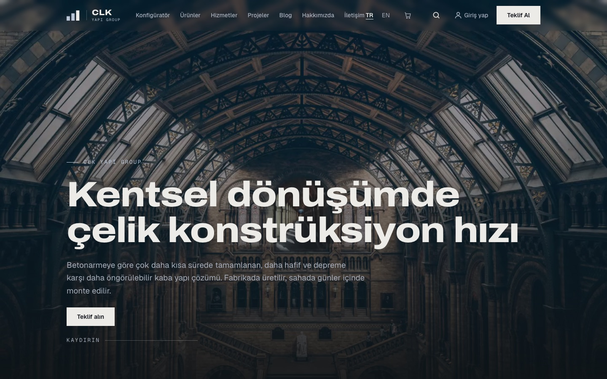
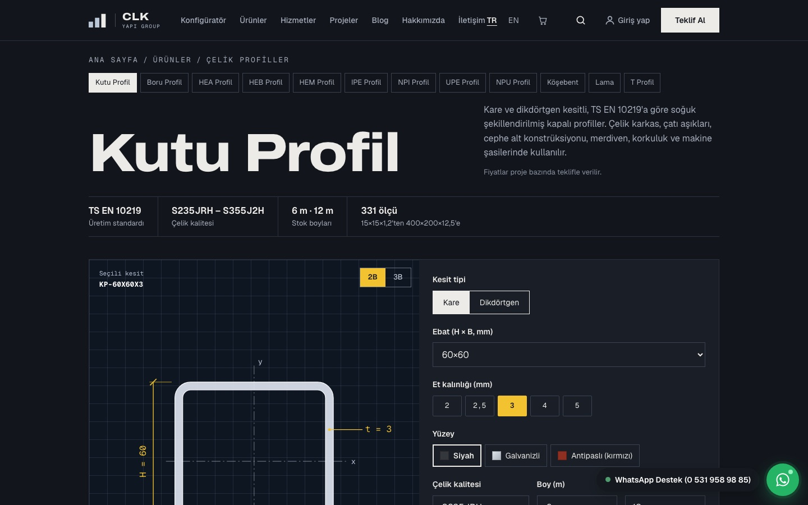
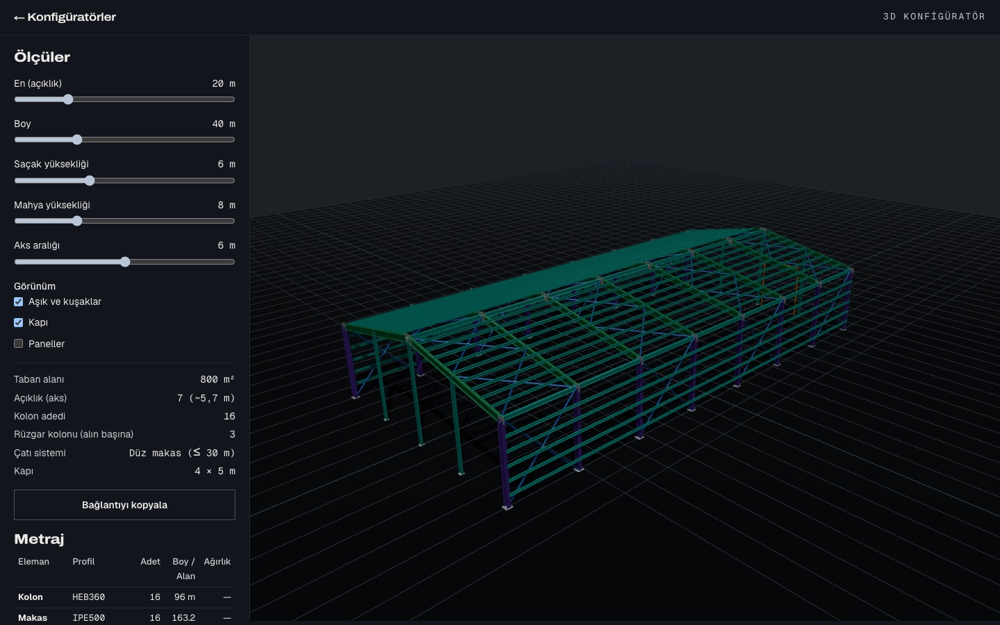
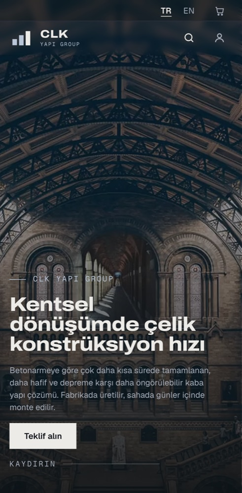
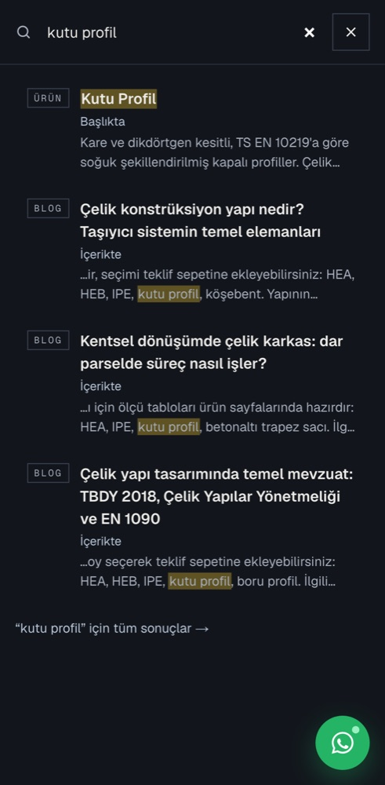
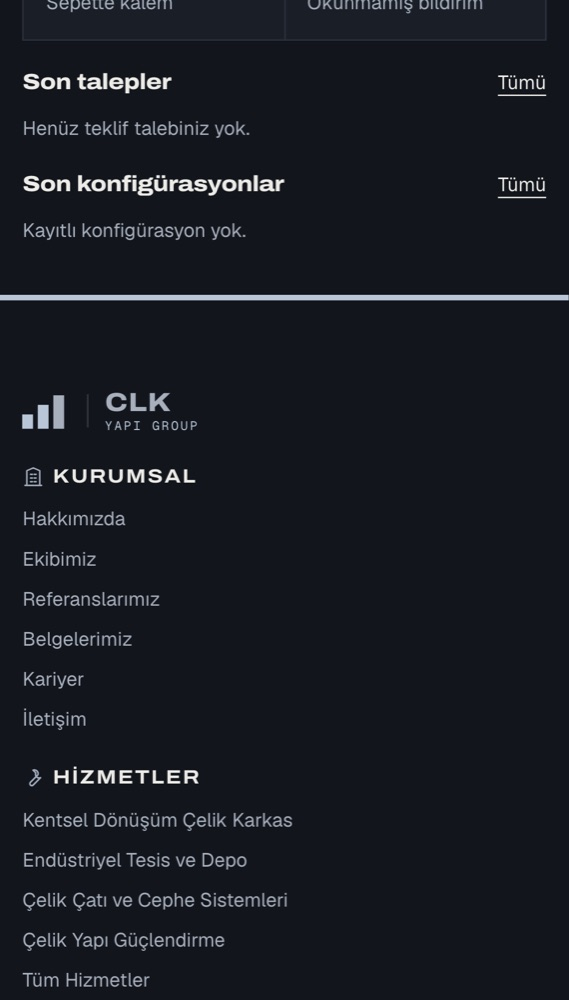

<div align="center">

# CLK Yapı Group — Kurumsal Site & Yönetim Sistemi

**Çelik konstrüksiyon firması için çift dilli (TR/EN) kurumsal web sitesi, 3B konfigüratörler, teklif sistemi, üye alanı ve tam kapsamlı yönetim paneli (CRM · satış · fatura · raporlama · analitik).**

[](https://github.com/davutakbulut/DVT-clk-yapi-group/actions/workflows/ci.yml)


-lightgrey)

**Canlı:** [clkyapigroup.com](https://clkyapigroup.com) · **Dokümantasyon:** [docs/00-START-HERE.md](docs/00-START-HERE.md) · **Durum:** [docs/ROADMAP.md](docs/ROADMAP.md) · **Kararlar:** [docs/02-DECISIONS.md](docs/02-DECISIONS.md)

</div>

---

## İçindekiler

- [Ne yapar](#ne-yapar)
- [Ekran görüntüleri](#ekran-görüntüleri)
- [Teknoloji](#teknoloji)
- [Mimari](#mimari)
- [Hızlı başlangıç](#hızlı-başlangıç)
- [Komutlar](#komutlar)
- [Test ve kalite](#test-ve-kalite)
- [Veritabanı](#veritabanı)
- [Dağıtım](#dağıtım)
- [Dokümantasyon](#dokümantasyon)
- [Temel kurallar](#temel-kurallar)
- [Yol haritası](#yol-haritası)
- [Lisans ve imza](#lisans-ve-imza)
- [English summary](#english-summary)

## Ne yapar

### Ön yüz (ziyaretçi)
| Alan | İçerik |
|---|---|
| **Ana sayfa** | Scroll ile oynayan saha videosu hero, hakkımızda, öne çıkan hizmet/ürün/proje, müşteri yorumları (Google Places senkronu) |
| **Ürün kataloğu** | 15+ çelik ürün ailesi (HEA/HEB/IPE/UNP, kutu ve boru profil, köşebent, trapez sac, sandviç panel…), her ölçünün kg/m ve kesit değerleri, kalite/boy/yüzey seçici, 2B kesit çizimi ve **tıklayınca yüklenen 3B görünüm**, teklif sepetine ekleme |
| **Konfigüratörler** | Endüstriyel hol · çok katlı çelik · çatı & cephe kaplama · ara kat platformu · çit & korkuluk · alçıpan bölme duvar — React Three Fiber 3B sahne, metraj motoru, URL ile paylaşım, kaydet/yazdır (PDF), üyeye fiyat tahmini |
| **Teklif sistemi** | Teklif sepeti (kalite, boy, kg hesabı), teklif formu, WhatsApp hızlı iletişim, mail kuyruğu ile bildirim |
| **Hesabım (üye alanı)** | Tekliflerim (durum, kalemler, yazışma, **revizyon / iptal isteği**), konfigürasyonlarım, cihazlar arası sepet senkronu, profil + firma bilgileri, şifre/e-posta değiştirme, hesap silme, bildirimler, KVKK veri indirme |
| **İçerik** | Hizmetler, çözüm sayfaları, projeler, blog (iç bağlantı zenginleştirme), fiyat rehberi + hesaplayıcı, kurumsal (ekip, referanslar, belgeler, kariyer, SSS), yasal sayfalar |
| **Site içi arama** | Header büyüteci: sayfalar, ürünler, ürün içerikleri, blog, SSS — hangi sayfanın hangi alanında eşleştiği gösterilir, tek RPC + önbellek + hız sınırı |
| **SEO & AI görünürlük** | Çift dilli `hreflang`, JSON-LD (Organization, Product, Article, FAQ, BreadcrumbList), site haritaları, RSS, IndexNow, `llms.txt`, `humans.txt`, AI botlarına açık `robots.txt` |

### Yönetim paneli (`/admin`)
| Alan | İçerik |
|---|---|
| **İçerik** | Tüm ön yüz içeriğinin CRUD'u (sıfır statik veri), medya kütüphanesi (WebP dönüşüm), çeviri onay akışı (makine taslağı + insan onayı), menü ve site ayarları |
| **Talep & müşteri** | Talep kutusu (cevap, not, dosya), müşteri kayıtları (CRM), müşteriden gelen mesaj/revizyon rozetleri |
| **Satış & finans** | Satış ve maliyet takibi, tevkifatlı faturalama, hakediş planı, tahsilat, kârlılık raporları (9 rapor) |
| **Konfigüratör** | Gönderimler, sürümler, tonaj/fiyat, JSON kural düzenleme, satışa dönüştürme |
| **Analitik & sistem** | Davranış analitiği, huni ve form analizi, sıcaklık haritası, hata takip, performans, kullanıcı/rol yönetimi, denetim izi, yedek/geri yükleme |

## Ekran görüntüleri

| Ana sayfa (masaüstü) | Ürün sayfası | Konfigüratör |
|---|---|---|
|  |  |  |

| Ana sayfa (mobil) | Arama (mobil) | Hesabım (mobil) |
|---|---|---|
|  |  |  |

## Teknoloji

| Katman | Seçim |
|---|---|
| Çatı | **Next.js 15** (App Router, RSC, Server Actions) · **TypeScript** (strict) |
| Stil | **Tailwind CSS v4** (cascade layers) · tasarım token'ları · ön yüz / admin stil izolasyonu |
| Veritabanı | **Supabase** — Postgres (83 tablo, tamamı RLS), Auth, Storage; 51 migration |
| Çok dillilik | **next-intl** — Türkçe birincil, İngilizce; çevrili URL'ler (`/tr/urunler` ↔ `/en/products`) |
| 3B | **React Three Fiber** + drei (yalnız konfigüratör ve ürün sayfası "3B" düğmesinde, tıklanınca yüklenir) |
| Animasyon | GSAP + ScrollTrigger · Lenis · Motion |
| Admin UI | shadcn/ui · TanStack Table · Recharts · Tiptap |
| Mail | Resend (birincil) + SMTP (yedek), kuyruklu ve yeniden denemeli |
| Test | Vitest · **PGlite** (Docker'sız migration + RLS testleri) · Playwright + axe (3 kırılım) |
| Hosting | cPanel / Passenger (Node 22) — Vercel ile de uyumlu |

## Mimari

```
src/
├── app/            Route dosyaları — ince (20–30 satır), iş mantığı modülde
│   ├── [locale]/   Ön yüz: (marketing) · (configurator)
│   ├── admin/      Yönetim paneli (İngilizce URL, Türkçe başlık)
│   └── api/        Route handler'lar (arama, hesap dışa aktarım, cron, feed'ler…)
├── modules/        31 alan modülü — account · products · configurator · leads · search · sales · finance …
│   └── <modül>/    domain/ (saf kurallar) · data/ (Supabase, RLS) · components/{site,admin} · index.ts · server.ts · actions.ts
├── core/           auth · db · errors (Result<T,E>, ModuleBoundary) · observability · jobs
├── i18n/           routing (çevrili pathnames), navigation
├── ui/             Ön yüz atomik bileşenler
└── styles/         Token'lar, tema, globals (cascade layers)
supabase/           migrations/ (0001–0051) · tests/ (PGlite, 31 dosya)
e2e/                Playwright (42 spec)
docs/               Kararlar (K-1…K-103), mimari, veritabanı, tasarım, modül spec'leri, süreçler
```

**Modül sınırları ESLint ile zorlanır:** `app → modules → core`; modüller birbirine yalnız `index.ts` / `server.ts` / `actions.ts` üzerinden erişir, derin import derlemede hata verir.
**Hata izolasyonu:** beklenen hatalar `Result<T, E>` ile döner; her bölüm `<ModuleBoundary>` içindedir — verisi gelmeyen bölüm sessizce render edilmez, sayfa çökmez.
**Yetkilendirme üç katman:** middleware (deneyim) → sunucu bileşeni rol kontrolü (kapı) → **RLS (gerçek sınır)**.

## Hızlı başlangıç

```bash
git clone https://github.com/davutakbulut/DVT-clk-yapi-group.git
cd DVT-clk-yapi-group
npm install
cp .env.example .env.local     # değerleri doldurun (Supabase'siz de açılır: bölümler sessizce boş kalır)
npm run dev
```

Ön yüz: `http://localhost:3000/tr` · Panel: `http://localhost:3000/admin`

Yerel Docker **yok** (K-47): şema PGlite testleriyle doğrulanır, migration'lar `npm run db:push` ile bağlı Supabase projesine uygulanır (hedef izin listesinden doğrulanır).

## Komutlar

| Komut | Ne yapar |
|---|---|
| `npm run dev` | Geliştirme sunucusu |
| `npm run check` | **PR öncesi hepsi:** lint · typecheck · test · circular · statik veri taraması · build |
| `npm run test` | Vitest birim testleri (`src/**/__tests__/`) |
| `npm run test:db` | PGlite üzerinde migration + RLS + RPC testleri (~5 sn, Docker'sız) |
| `npm run test:e2e` | Playwright + axe — üretim derlemesine karşı, mobil / tablet / masaüstü |
| `npm run scan:static` | "Sıfır statik veri" kuralı taraması |
| `npm run circular` | Döngüsel bağımlılık denetimi (madge) |
| `npm run db:push` · `db:types` · `db:report` | Migration uygula · tip üret · şema gezgini HTML |
| `npm run media:migrate` · `media:report` | `assets/` → WebP → Storage · medya galerisi |
| `npm run backup:export` · `backup:drill` | Yedek dışa aktarım · geri yükleme tatbikatı |
| `bash scripts/cpanel-deploy.sh` | Paketle + cPanel'e yükle + Passenger yeniden başlat (önceki derlemenin statik parçaları korunur) |

## Test ve kalite

- **CI** (`.github/workflows/ci.yml`): lint · typecheck · Vitest · circular · statik veri taraması · build · `npm audit` (üretim bağımlılıkları) · Playwright + axe (3 kırılım).
- **Veritabanı testleri** gerçek migration dosyalarını PGlite'a uygular; RLS her rolle (anon, member, sales, admin…) ve "başkasının kaydını göremez" senaryolarıyla test edilir.
- **E2E** kritik akışlar: teklif → admin cevap, sepet, konfigüratör kaydet/paylaş/yazdır, ürün seçici, arama, hesabım (talep → revizyon isteği → admin rozeti), mobil yatay taşma denetimi, erişilebilirlik.
- **Bitti tanımı** her fazda: build/lint/typecheck temiz · ön yüz ↔ admin karşılık matrisi · 3 kırılımda gözle kontrol · klavye gezinme · axe · RLS yetkisiz rolle · Lighthouse eşik üstü.

## Veritabanı

- 83 tablo + 4 görünüm, hepsi RLS'li; sözleşmeler (`updated_at`, slug kısıtı, yayın durumu) `app_private` prosedürleriyle tek satırda uygulanır → unutulamaz.
- İçerik JSONB çok dilli: `{"tr": "...", "en": "..."}`; `published_locales` içinde `en` yoksa İngilizce sitede 404.
- Türkçe slug tuzağı: `toLowerCase()` yasak, açık harf çevrim tablosu + `CHECK` kısıtı.
- Kritik iş mantığı RPC'lerde (`submit_lead`, `search_site`, `customer_lead_message`, `delete_my_account` …) — security definer, açık yetki kontrolü.
- Bkz. [docs/database/](docs/database/) ve `npm run db:report`.

## Dağıtım

Canlı site cPanel (CloudLinux Node.js / Passenger) üzerinde çalışır; veritabanı ve dosyalar Supabase'de. Paket bilgisayarda derlenir, zip olarak yüklenir, sırlar sunucuda `secrets.env` içinde tutulur. Ayrıntı: [docs/processes/06-DEPLOY-CPANEL.md](docs/processes/06-DEPLOY-CPANEL.md). Proje Vercel'e de olduğu gibi dağıtılabilir (`vercel.json`).

## Dokümantasyon

**[docs/00-START-HERE.md](docs/00-START-HERE.md) ile başlayın** — yapacağınız işe göre okuma sırası orada.

| Konu | Yer |
|---|---|
| Proje özeti ve terim sözlüğü | [docs/01-PROJECT-OVERVIEW.md](docs/01-PROJECT-OVERVIEW.md) |
| Kararlar ve gerekçeleri (K-1 … K-103) | [docs/02-DECISIONS.md](docs/02-DECISIONS.md) |
| Mimari · routing/i18n · hata izolasyonu · performans · kod standartları | [docs/architecture/](docs/architecture/) |
| Şema · RLS/yetki · migration akışı | [docs/database/](docs/database/) |
| Tasarım sistemi · stil izolasyonu · responsive/animasyon · tasarım kuralları | [docs/design/](docs/design/) |
| Modül spesifikasyonları (ön yüz, admin, katalog, konfigüratör, satış/finans, analitik, mail, hesabım) | [docs/modules/](docs/modules/) |
| Süreçler: çeviri · SEO & AI görünürlük · güvenlik/KVKK · test · ortamlar · cPanel dağıtım · **kötüye kullanım dayanıklılığı** | [docs/processes/](docs/processes/) |
| Güncel durum ve fazlar | [docs/ROADMAP.md](docs/ROADMAP.md) |
| Değişiklik geçmişi | [docs/CHANGELOG.md](docs/CHANGELOG.md) |
| Katkı kuralları | [docs/CONTRIBUTING.md](docs/CONTRIBUTING.md) |
| AI oturumları için bağlayıcı kurallar | [CLAUDE.md](CLAUDE.md) |

## Temel kurallar

1. **Sıfır statik veri** — ön yüzde görünen hiçbir içerik koda gömülmez; hepsi veritabanından gelir ve panelden düzenlenir.
2. **Modül sınırları** — modüller yalnız public API üzerinden konuşur; derin import ESLint'te hata.
3. **`main` her zaman dağıtılabilir** — yarım iş merge edilmez.
4. **Her faz dikey dilim** — bir özelliğin ön yüzü ve admin karşılığı aynı fazda biter.
5. **Uydurma içerik yok** — fiyat, müşteri yorumu, sertifika, proje bilgisi asla icat edilmez.
6. **Gerçek anahtar repoya girmez** — depo herkese açıktır (K-45); `.env.example` yalnız yer tutucu içerir.

## Yol haritası

31 faz tamamlandı (kurulum → tasarım sistemi → içerik modülleri → teklif/CRM/satış/finans → analitik → 3B konfigüratörler → hesabım → AI görünürlük → kapanış). Açık kalemler ve ürün sahibi görevleri (Search Console, Google Business Profile, gerçek fiyat listeleri) [docs/ROADMAP.md](docs/ROADMAP.md) içindedir.

## Lisans ve imza

Kaynak kod ve içerik **CLK Yapı Group**'a aittir; ayrıntı için [LICENSE](LICENSE). Herkese açık olması inceleme ve öğrenme amaçlıdır; yeniden kullanım için yazılı izin gerekir. Güvenlik bildirimi: [SECURITY.md](SECURITY.md).

Tasarım ve geliştirme: **Davut Akbulut | Dijital Web Ajansı**

## English summary

Bilingual (TR/EN) corporate website and back office for a steel construction company: product catalogue with section properties and click-to-load 3D views, six React Three Fiber configurators with quantity take-off, quote basket and lead pipeline, member area (quotes with revision requests, saved configurations, cross-device basket, profile/company details, security, GDPR/KVKK export and account deletion), site-wide search, SEO/AI-visibility tooling, and an admin panel covering content, CRM, sales & costs, withholding-tax invoicing, progress payments, reporting, behaviour analytics, heatmaps and error tracking. Built with Next.js 15, TypeScript, Tailwind v4, Supabase (Postgres + RLS) and next-intl; tested with Vitest, PGlite and Playwright + axe; deployed to cPanel/Passenger. Zero hard-coded content, enforced module boundaries, `Result`-based error isolation and three-layer authorization with RLS as the real boundary. See [docs/00-START-HERE.md](docs/00-START-HERE.md).
